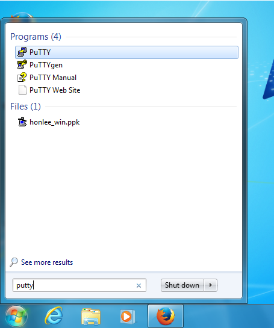
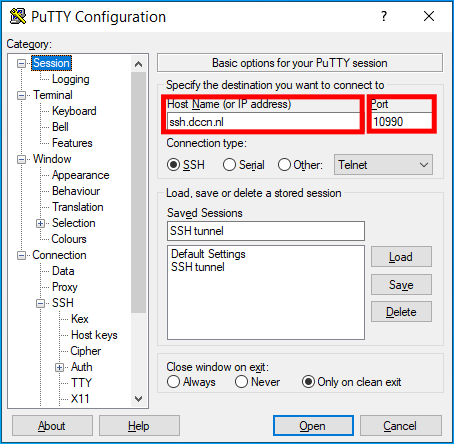
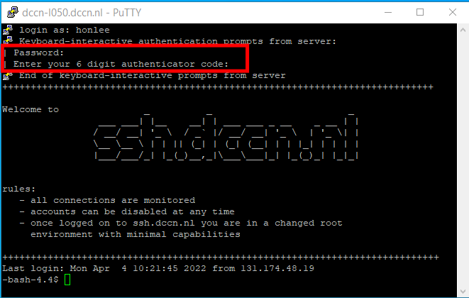
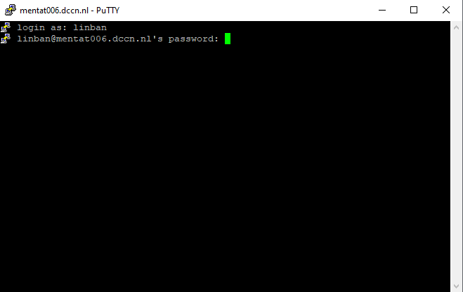
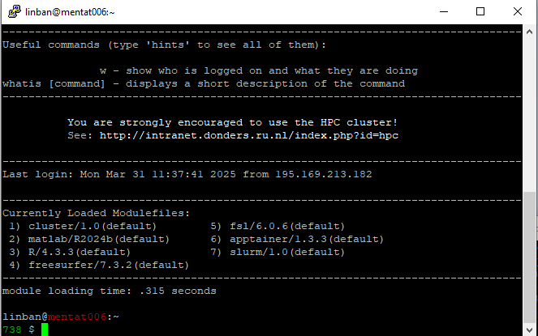
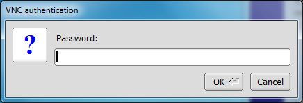
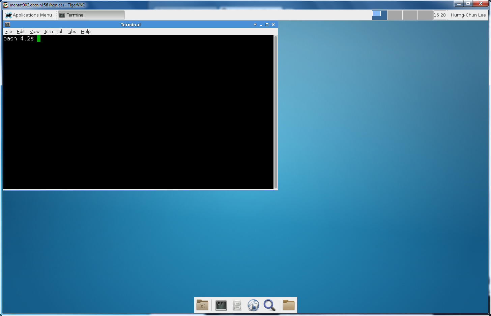

Access from outside of DCCN
***************************

If you are at home or on travel, or connecting your personal laptop to the edurom network, you are not allowed to connect to the access nodes directly as they are in the DCCN network protected by a firewall.  In this case, you need to make the connection indirectly via the so-called SSH tunnel.

The SSH tunnel
==============

A SSH gateway named ``ssh.fcdonders.nl`` is provided for setting the SSH tunnels. When setting up a tunnel for connecting to a target service behind the firewall, one needs to choose a local network port that is still free for use on your desktop/laptop (i.e. the ``Source port``) and provides the network endpoint (i.e. the ``Destination``) referring to the target service.

.. tip::
    This technique can also be applied for accessing different services protected by the DCCN firewall.

Instructions in video
=====================

The following screencast will guide you through the steps of accessing the cluster via the SSH tunnel.

.. raw:: html

    <iframe width="560" height="315" src="https://www.youtube.com/embed/mjgDVx_k4dU" frameborder="0" allowfullscreen></iframe>

Putty login via SSH tunnel
==========================

In this example, we choose ``Source port`` to be ``8022``.  The ``Destination`` referring to the SSH server on mentat001 should be ``mentat001:22``.

* Follow the steps below to establish the tunnel for SSH connection:

    step 1: start putty on the Windows desktop

    step 2: configure putty for connecting to the SSH gateway ``ssh.fcdonders.nl``

    step 3: configure putty to initiate a local port ``8022`` for forwarding connections to ``mentat001:22``

    step 4: login the gateway with your username and password to establish the tunnel

.. note::
    Once you have logged in the gateway, you should keep the login window open.

* Make another SSH connection to the local port as follows:

    step 1: tart putty on the Windows desktop

    step 2: onfigure putty for connecting to ``localhost`` on port ``8022``

    step 3: login with your username and password

    step 4: get the test-based virtual terminal with a shell prompt

VNC via SSH tunnel
==================

In this example, we choose ``Source port`` to be ``5956``.  We also assume that a VNC server has been started on ``mentat002`` with the display number ``56``. The ``Destination`` referring to the VNC server should be ``mentat002:5956``.

.. note::
    The display number *56* is just an example.  In reality, you should replace it with a different number assigned by the *vncmanager*.  Nevertheless, the network port number is always the display number plus *5900*.

* Follow the steps below to establish the tunnel for VNC connection:

    step 1: start putty on the Windows desktop

    step 2: configure putty for connecting to the SSH gateway ``ssh.fcdonders.nl``

    step 3: configure putty to initiate a local port ``5956`` for forwarding connections to ``mentat002:5956``

    step 4: login the gateway with your username and password to establish the tunnel

.. note::
    Once you have logged in the gateway, you should keep the login window open.

* Connect VNC client to the local port as follows:

.. figure:: figures/start_tigerVNC.png
    :figwidth: 60%

    step 1: open TigerVNC application

    step 2: enter the display endpoint (``localhost:5956``) as the VNC server

    step 3: enter the authentication password you set via the ``vncpasswd`` command

    step 4: get the graphical desktop of the access node
