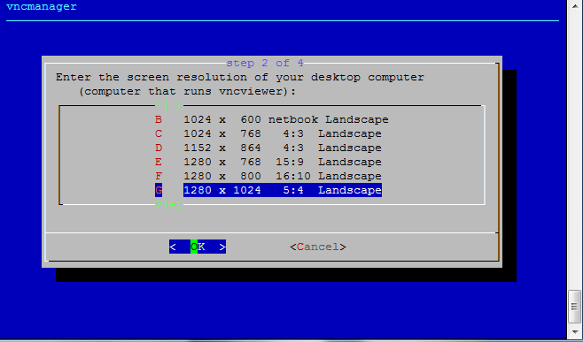
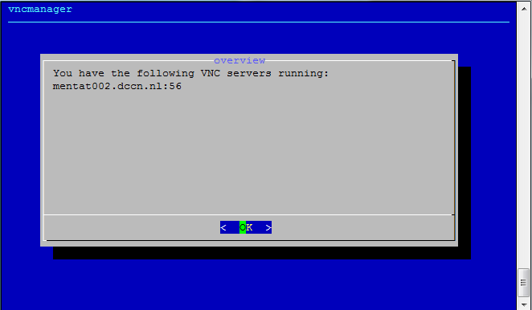
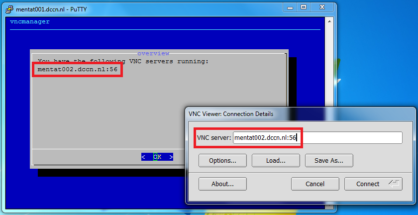
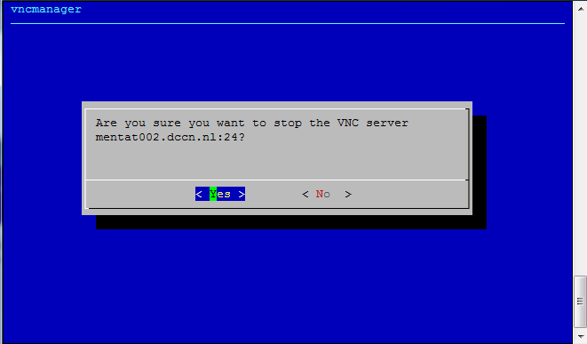

Getting access to the HPC cluster
*********************************

.. _ssh_login_with_putty:

SSH login with Putty
====================

Follow the steps below to connect to one of the cluster's access nodes, using the SSH.

Screenshots of the four steps are shown below:

.. figure:: figures/start_putty.png
    :figwidth: 60%

    step 1: start putty on the Windows desktop

    step 2: configure putty for connecting to, e.g., ``mentat001.dccn.nl``

.. figure:: figures/putty_login_username_password.png
    :figwidth: 60%

    step 3: login with your username and password

.. figure:: figures/putty_login_success.png
    :figwidth: 60%

    step 4: get a test-based virtual terminal with a shell prompt

SSH logout
==========

You can logout the system by either closing the Putty window or typing the command ``exit`` in the virtual terminal.

VNC for graphic desktop
=======================

.. note::
    For the first-time user, type

    .. code-block:: bash

        $ vncpasswd

    in the putty terminal to protect your VNC server from anonymous access before following the instructions below.

Firstly, start the VNC server by typing the following command in the putty terminal.

.. code-block:: bash

    $ vncmanager

Follow the step-by-step instructions on the screen to initiate a VNC server. See the screenshots below as an example.

    step 1: start a new VNC server

.. figure:: figures/vncmanager_startvnc_chosehost.png
    :figwidth: 60%
    :alt: step 2

    step 2: select host

    step 3: choose resolution

    step 4: make fullscreen

    step 5: select windows manager

    step 6: VNC server started with a display endpoint

In the screenshots above, we have started a VNC server associated with a display endpoint ``mentat002.dccn.nl:56``.  To connect to it, we use a VNC client called TigerVNC Viewer.  Follow the steps below to make the connection:

.. note::
    The display endpoint ``mentat002.dccn.nl:56`` is just an example.  In reality, you should replace it with a different endpoint given by the ``vncmanager``.

    step 1: open the TigerVNC Viewer (double-click the icon on the desktop)

    step 2: enter the display endpoint (``mentat002.dccn.nl:56``) as the VNC server

.. figure:: figures/tigerVNC_auth.png
    :figwidth: 60%

    step 3: enter the authentication password you set via the ``vncpasswd`` command

.. figure:: figures/tigerVNC_success.png
    :figwidth: 60%

    step 4: get the graphical desktop of the access node

Disconnect VNC server
=====================

To disconnect the VNC server, simply close the TigerVNC-viewer window in which the graphical desktop is displayed. The VNC server will remain available, and can be reused (re-connected) when you need to use the graphical desktop again in the future.

.. warning::
    **DO NOT** logout the graphical desktop as it causes the VNC server become unaccessible afterwards.

Terminate VNC server
====================

Since the graphical windows manager takes significant amount of resources from the system, it is strongly recommended to terminate the VNC server if you are not actively using it.  Terminating a VNC server can be done via the ``vncmanager`` command.  The steps are shown in the screenshots below:

    step 1: stop a VNC server

    step 2: choose a server to be stopped

    step 3: confirm and stop the server
