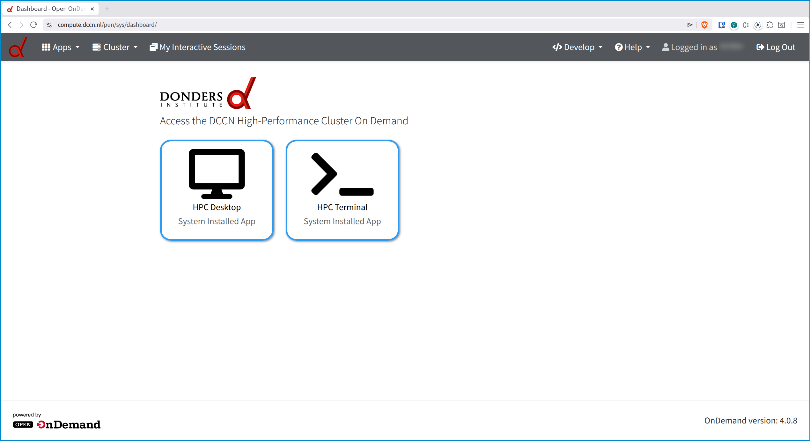
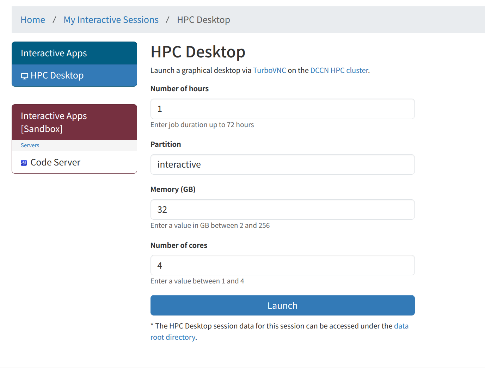
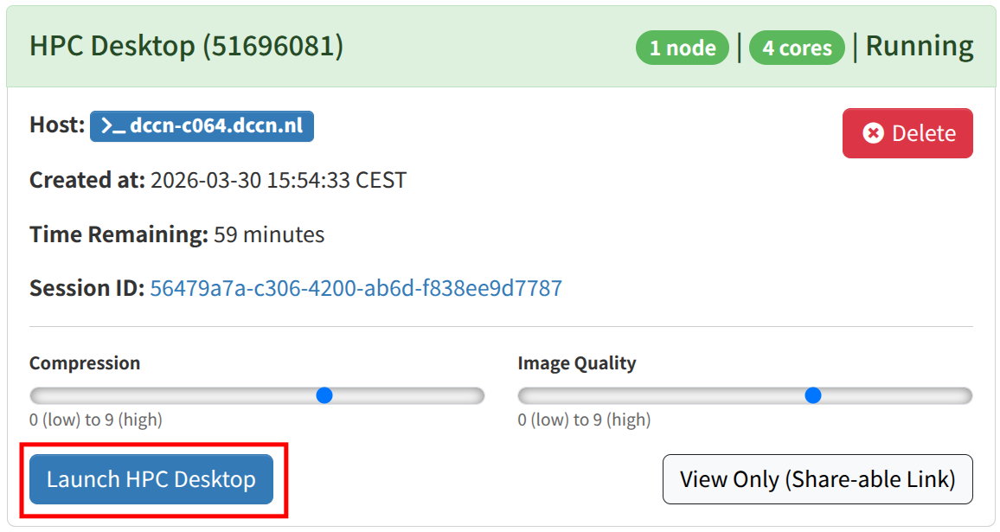
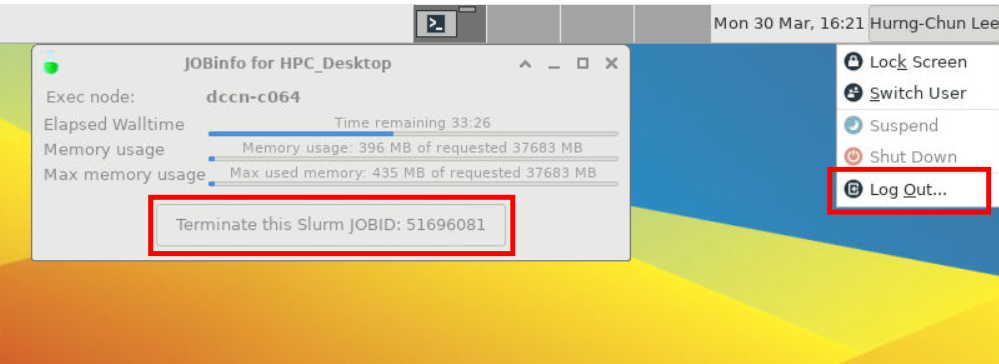

.. _access-ood:

Web access
**********

The DCCN HPC cluster provides a Web-based interface, powered by `Open OnDemand <https://https://www.openondemand.org/>`_.   With this access method, you only need a modern web browser to access the terminal on the cluster's access node or run a full desktop environment on a compute node.

Follow the instruction below to connect to the cluster's web interface:

Requirements
============

* a modern web browser on your device, such as Firefox, Chrome or Safari
* connection to the DCCN Trigon network via the office wired network or wirelessly with eduVPN (full trigon access), see :ref:`access-external-eduvpn`.

Connect
=======

Open the browser and go to the URL `https://compute.dccn.nl <https://compute.dccn.nl>`_. You will encounter a login page.  Please login with your DCCN account.

After login, you will see two applications, the *HPC Terminal* and *HPC Desktop*.

HPC Terminal
============

By clicking the application *HPC Terminal*, a terminal will be open on one of the HPC access (i.e. mentat) nodes.  It is a terminal with BASH shell.  You could run Linux commands or submit batch jobs further to the cluster compute nodes, see :ref:`run-computations-slurm`.

HPC Desktop
===========

By clicking the application *HPC Desktop*, you will encounter a job submission form.  You could use the form to specify the compute resources required for your full dekstop environment to run as a batch job.

.. note::

    If you consider to run any computation or application in the same job of the HPC Desktop, make sure you specify sufficient resources for starting the HPC Desktop.  In this approach, the HPC Desktop environment will share the same job resource with your computation. 

    Nevertheless, it is recommended that you make further job submission within your HPC Desktop.  In this approach, you HPC Desktop has dediciated job resource to operate (can result in better user experience); and you have more flexibility to use the same HPC Desktop for different computations having different requirements.

After clicking the *Launch* button the form, the browser will be redirected to the page *My Interactive Sessions* while a Slurm job is submitted to the high-priority *interactive* queue for starting a new VNC session on a compute node.

After the job is started, a button *Launch HPC Desktop* will show up allowing you to open the started VNC session using the browser.

Disconnect the VNC
------------------

After you close the browser or disconnect to the Internet, like a batch job, the VNC session will continue to run in the cluster until its resource limit.

Since the VNC password is rotated everytime it is used, for re-connecting to a running VNC session, you should always go through the *My Interactive Sessions* of the `web site <https://compute.dccn.nl>`_ and use the *Launch HPC Desktop* button for the new VNC password.

Logging out the VNC
-------------------

When the VNC session is no longer needed, you can close it by either logging out the desktop environment or terminating the job via the buttons highlighted in the screenshot below.

