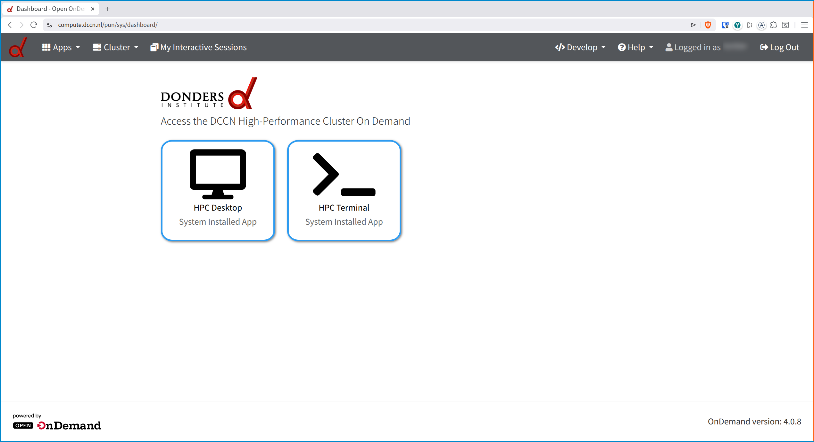
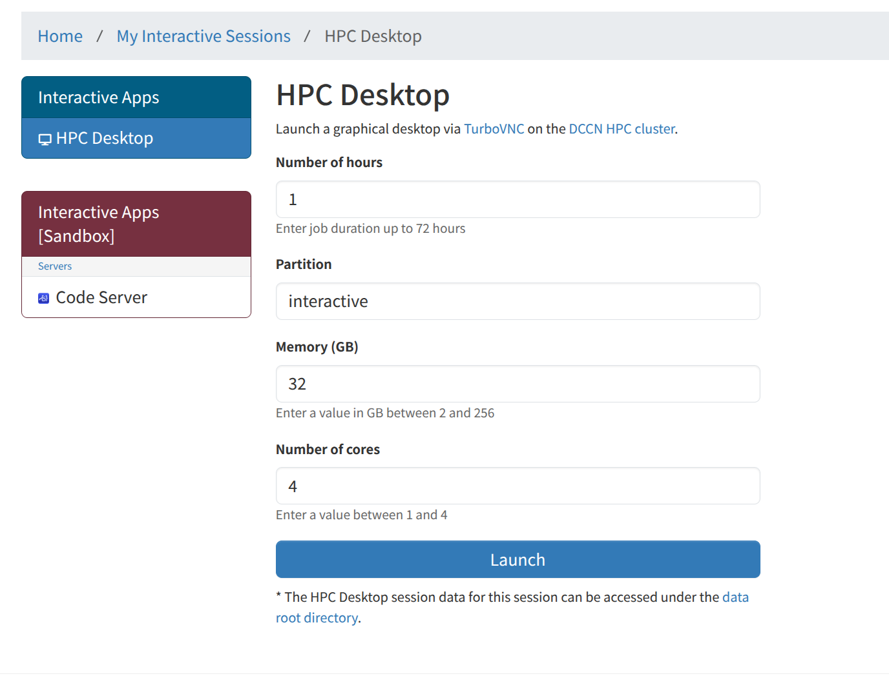
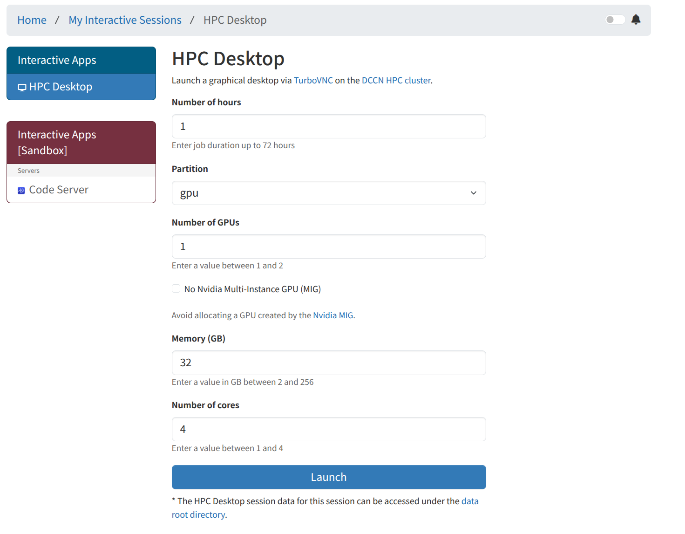
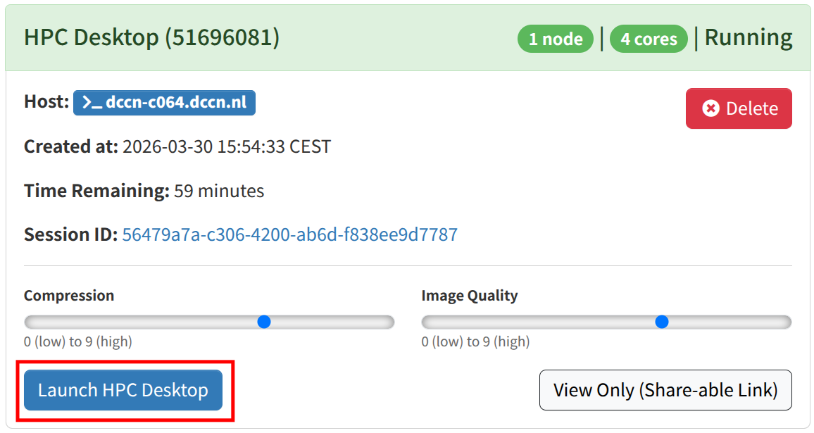
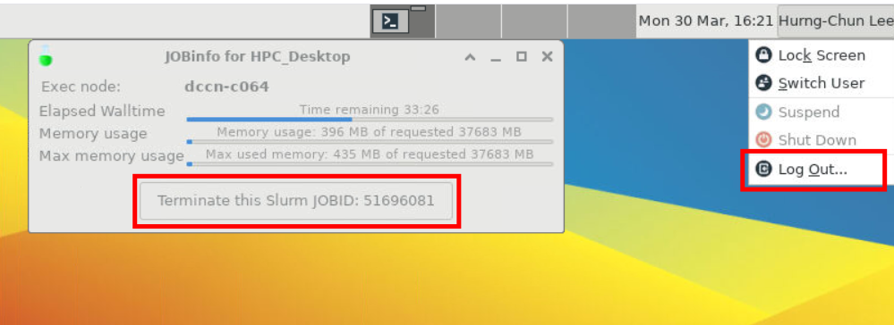

.. _access-ood:

Web access
**********

The DCCN HPC cluster provides a Web-based interface, powered by `Open OnDemand <https://https://www.openondemand.org/>`_.   With this access method, you only need a modern web browser to access the terminal on the cluster's access node or run a full desktop environment on a compute node.

Follow the instruction below to connect to the cluster's web interface:

Requirements
============

* a modern web browser on your device, such as Firefox, Chrome or Safari
* connection to the DCCN Trigon network via the office wired network or wirelessly with eduVPN (full trigon access), see :ref:`access-external-eduvpn`.

Connect
=======

Open the browser and go to the URL `https://compute.dccn.nl <https://compute.dccn.nl>`_. You will be asked to login with your DCCN account.

After logging in, you will see two main applications, the *HPC Terminal* and *HPC Desktop*.

HPC Terminal
============

.. tip::

    HPC Terminal provides a terminal session on a cluster's access node. It is suitable for running short command-line applications or submitting batch jobs to the cluster's compute nodes.

When you click on the *HPC Terminal* application, a terminal session will open on one of the HPC access nodes (e.g., mentat). This terminal runs a Bash shell, allowing you to execute Linux commands or submit batch jobs to the cluster’s compute nodes (see :ref:`run-computations-slurm`).

HPC Desktop
===========

.. tip::

    HPC Desktop is a full desktop environment running as a Slurm job on a compute node. Therefore, the resources allocated to the HPC Desktop session are shared with any computations or applications you run within the same job. It is suitable for running compute-intensive applications interactively, such as MATLAB, RStudio, or Jupyter Notebook, which require a graphical user interface (GUI) and significant computational resources.

When you click on the *HPC Desktop* application, a job submission form will be presented. You can use this form to specify the compute resources required to run your full desktop environment as a batch job.

By switching the *Partion* option to *gpu* or *gpu40g*, you can request a GPU node to run your desktop environment.  Use the tickbox *No Nvidia Multi-Instance GPU (MIG)* to avoid GPU patitions created by `the Nvidia MIG <https://www.nvidia.com/en-us/technologies/multi-instance-gpu/>`_.  See example screenshot below for the *gpu* partition.

After clicking the *Launch* button on the form, your browser will be redirected to the *My Interactive Sessions* page, while a Slurm job is submitted to the high-priority interactive queue to start a new VNC session on a compute node. Once the job has started, a *Launch HPC Desktop* button will appear, allowing you to open the VNC session in your browser.

.. note::

    If a browser is not touched for a while or the Internet connection is lost, the web session will be automatically logged out.  The VNC server will continue running on the cluster, just like a batch job, until it reaches its allocated resource limit.

    You cannot reload the VNC session in the browser after the web session is logged out as the VNC password is rotated each time it is used.  You should always reconnect to a running VNC session via the *My Interactive Sessions* page on the `web site <https://compute.dccn.nl>`_. Clicking the *Launch HPC Desktop* button will automatically handle the password in the background.

Disconnect the VNC
------------------

After you close the browser or lose your Internet connection, the VNC session will continue running on the cluster, just like a batch job, until it reaches its allocated resource limit.

Since the VNC password is rotated each time it is used, you should always reconnect to a running VNC session via the *My Interactive Sessions* page on the `web site <https://compute.dccn.nl>`_. Clicking the *Launch HPC Desktop* button will automatically handle the password in the background.

Logging out the VNC
-------------------

When the VNC session is no longer needed, you can close it by either logging out of the desktop environment or terminating the job using the buttons highlighted in the screenshot below.

