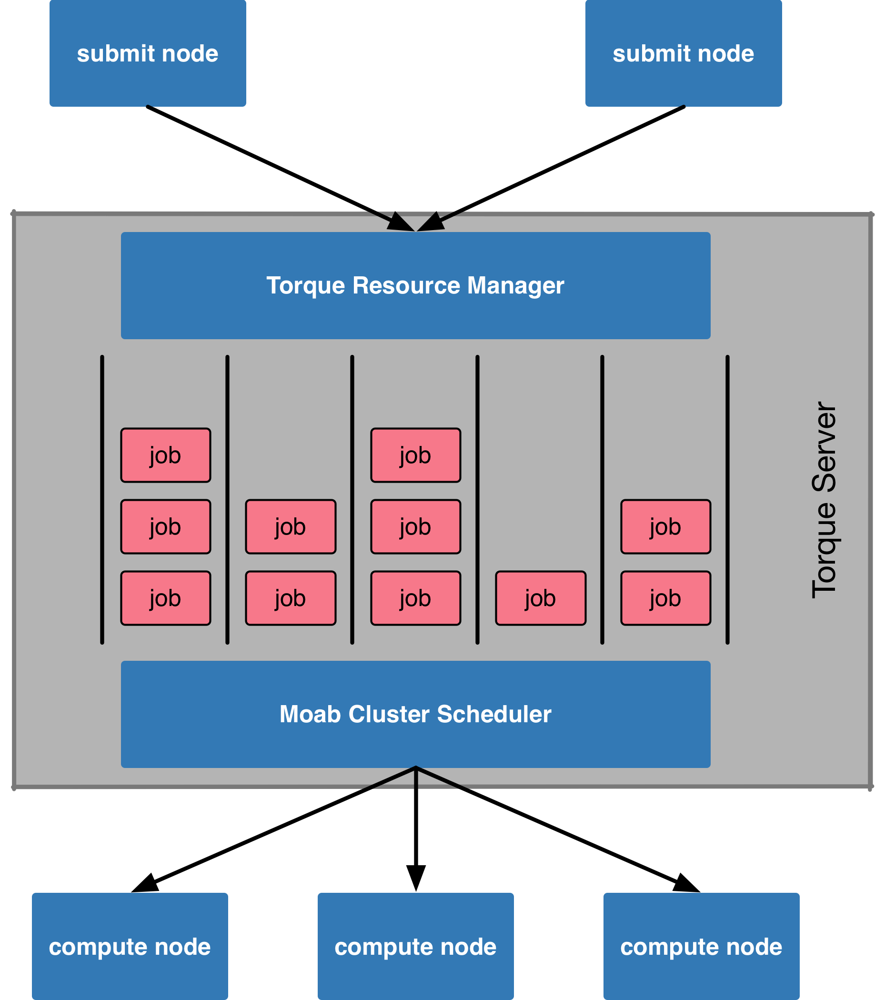
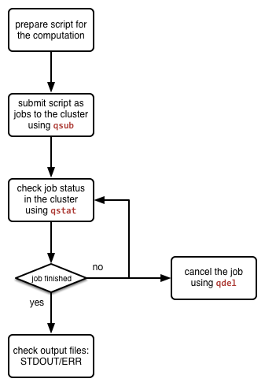

Running computations on the Torque cluster
******************************************

What is the Torque cluster?
===========================

The Torque cluster is a pool of high-end computers (also referred to as **compute nodes**) managed by a resource manager called `Torque <http://www.adaptivecomputing.com/products/open-source/torque/>`_ and a job scheduler called `Moab <http://www.adaptivecomputing.com/products/hpc-products/moab-hpc-basic-edition/>`_. Instead of allowing users to login to one computer and run computations freely, user **submit** their computations in forms of **jobs** to the Torque cluster.  A sketch in the picture below summarises how jobs are being managed by the Torque server and scheduled by its companion, the Moab server, to perform computations on the compute nodes in the cluster.

    Figure: a simplified view of the torque cluster architecture.

Every job is submitted to the Torque cluster with a set of resource requirement (e.g. duration of the computation, number of CPU cores, amount of RAM, etc.).  Based on the requirement, jobs are arranged internally in **job queues**. The Moab scheduler is responsible for prioritising jobs and assign them accordingly to compute nodes on which the jobs' requirements are fulfilled. The system also guarantees dedicated resources for the computation. Thus, interference between different computations is minimised, resulting in more predictable job completion time.

Resource sharing and job prioritisation
=======================================

For optimising the utilisation of the resources of the Torque cluster, certain resource-sharing and job prioritisation policies are applied to jobs submitted to the cluster.  The implications to users can be seen from the the three aspects: **job queues**, **throttling policies for resource usage** and **job prioritisation**.

Job queues
----------

In the cluster, several job queues are made available in order to arrange jobs by resource requirements.  Those queues are summarised in the table below. Queues are mainly distinguished by the wall time and memory limitations.  Some queues, such as *matlab*, *vgl* and *interactive*, have their own special purpose for jobs with additional resource requirements.

+------------+---------------+-----------------------+---------------------+----------------------+--------------+
| queue name | routing queue | max. walltime per job | max. memory per job | special feature      | job priority |
+============+===============+=======================+=====================+======================+==============+
| matlab     | N/A           | 24 hours              | 256 GB              | matlab license       | normal       |
+------------+---------------+-----------------------+---------------------+----------------------+--------------+
| vgl        | N/A           |  8 hours              |  10 GB              | VirtualGL capability | normal       |
+------------+---------------+-----------------------+---------------------+----------------------+--------------+
| short      | N/A           |  2 hours              |   8 GB              |                      | normal       |
+------------+---------------+-----------------------+---------------------+----------------------+--------------+
| veryshort  | N/A           | 20 minutes            |   8 GB              |                      | normal       |
+------------+---------------+-----------------------+---------------------+----------------------+--------------+
| long       | automatic     | 24 hours              |   8 GB              |                      | normal       |
+------------+---------------+-----------------------+---------------------+----------------------+--------------+
| batch      | automatic     | 48 hours              | 256 GB              |                      | normal       |
+------------+---------------+-----------------------+---------------------+----------------------+--------------+
| verylong   | automatic     | 72 hours              |  64 GB              |                      | normal       |
+------------+---------------+-----------------------+---------------------+----------------------+--------------+
| interactive| automatic     | 72 hours              |  64 GB              | user interaction     | high         |
+------------+---------------+-----------------------+---------------------+----------------------+--------------+

At the job submission time, user can specify to which queue the job should be placed in the system. Alternatively, one could simply specify the wall time and memory required by the job and let the system pick up a most proper queue automatically for the job.  The second approach is implemented by the *automatic* queue behaving as a router to a destination queue.

Throtteling policies for resource usage
---------------------------------------

In the Torque cluster at DCCN, throttle policies are applied to limit the amount of resources an user can allocate at the same time.  It is to avoid resources of the entire cluster being occupied by a single user.  The policies are defined in two scopes:

#. Queue-wise policies

   For every job queue, the total number of **runnable** and **queue-able** jobs per user are throttled.  In the table below, the *max. runnable jobs* specifies the maximum number of running jobs a user is allowed to have in a queue at a given time; while the *max. queueable jobs* restricts the total number of jobs (including idle, running and blocked jobs) a user is allowed to have.

   +------------+--------------------+----------------------+
   | queue name | max. runnable jobs | max. queue-able jobs |
   +============+====================+======================+
   | matlab     | 300                | 2000                 |
   +------------+--------------------+----------------------+
   | short      | 300                | 2000                 |
   +------------+--------------------+----------------------+
   | veryshort  | 300                | 2000                 |
   +------------+--------------------+----------------------+
   | long       | 300                | 2000                 |
   +------------+--------------------+----------------------+
   | batch      | 300                | 2000                 |
   +------------+--------------------+----------------------+
   | verylong   | 300                | 2000                 |
   +------------+--------------------+----------------------+
   | vgl        |   2                |    5                 |
   +------------+--------------------+----------------------+
   | interactive|   2                |    4                 |
   +------------+--------------------+----------------------+

   For most of queues, the number of runnable and queue-able jobs are set to 300 and 2000, respectively. However, more restricted policies are applied to jobs in the *vgl* and *interactive* queues. For jobs in the *vgl* queue, the maximum runnable and queue-able jobs are set to 2 and 5, respectively; while they are 2 and 4 for jobs in the *interactive* queue.  This is to compensate for the facts that *vgl* jobs consume lots of the network bandwidth; and *interactive* jobs always have the highest priority to start.

#. Cluster-wise policies

   The cluster-wise throttling is to limit the total amount of resources a single user can occupy at the same time in the cluster. The three upper-bound (cluster-wise) limitations are:

   * 300 jobs
   * 660 days processing (wall)time
   * 1 TB memory

   It implies that if the resource utilisation of your current running jobs reaches one of the above limitations, your additional jobs have to wait in the queue regardless whether there are still available resources in the cluster.

Job prioritisation
------------------

Job priority determines the order of waiting jobs to start in the cluster. Job priority is calculated by the Moab scheduler taking into account various factors.  In the cluster at DCCN, mainly the following three factors are considered.

#. **The waiting time a job has spent in the queue**: this factor will add one additional priority point to jobs waiting for one additional minute in the queue.

#. **Queue priority**: this factor is mainly used for boosting jobs in the *interactive* queue with an outstanding priority offset so that they will be started sooner than other types of jobs.

The final job priority combining the three factors is used by the scheduler to order the waiting jobs accordingly. The first job in the order is the next to start in the cluster.

Note: Job priority calculation is dynamic and not complete transparent to users.  One should keep in mind that the cluster does not treat the jobs as "first-come first-serve".

Job management workflow
=======================

    Figure: the generic job management workflow.

The Torque system comes with a set of command-line tools for users to manage jobs in the cluster. These tools are generic and can be utilised for running various types of analysis jobs.  The picture on the left shows a general job management lifecycle when running your computations in the cluster. The three mostly used tools during the job management lifecycle are: ``qsub`` for submitting jobs to the cluster, ``qstat`` for checking jobs' status in the cluster, and ``qdel`` for cancelling jobs.  The usage of them are given below.

Batch job submission
====================

The ``qsub`` command is used to submit jobs to the Torque job manager.  The first and simplest way of using ``qsub`` is pipelining a command-line string to it.  Assuming that we want to display the hostname of the compute node on which the job will run, we issue the following command:

.. code-block:: bash

    $ echo '/bin/hostname -f' | qsub -l 'procs=1,mem=128mb,walltime=00:10:00'

Here we ``echo`` the command we want to run (i.e. ``/bin/hostname -f``) as a string, and pass it to ``qsub`` as the content of our job. In addition, we also request for resources of 1 processor with 128 megabytes RAM for a walltime of 10 minute, using the ``-l`` option.

In return, you will receive an unique job identifier similar to the one below.

.. code-block:: bash

    6278224.dccn-l029.dccn.nl

It is "the" identifier to be used for tracing the job's progress and status in the cluster. We will show it later; for the moment, we continue with a different way of using the ``qsub`` command.

It is more realistic that our computation involves a set of commands to be executed sequentially. A more handy way is to compose those commands into a BASH script and hand the script over to the ``qsub`` command. Assuming we have made a script called ``my_analysis.sh`` right in the present working directory (i.e. ``PWD``), we can then submit this script as a job via the following command:

.. code-block:: bash

    $ qsub -l 'procs=1,mem=128mb,walltime=00:10:00' ${PWD}/my_analysis.sh

It is very often that the same analysis needs to be repeated on many datasets, each corresponds to, for example, a subject.  It would be smart to implement the ``bash`` script with additional arguments to switch between datasets.  Assuming that the ``my_analysis.sh`` is now implemented to take one argument as the subject index, submitting the script to run on the dataset of subject ``001`` would look like the example below:

.. code-block:: bash

    $ echo "${PWD}/my_analysis.sh 001" | qsub -N 's001' -l 'procs=1,mem=128mb,walltime=00:10:00'

.. note::
    The command above for passing argument to script is actually a workaround as ``qsub`` (of currently installed version) does not provide options to deal with the command arguments.

Interactive computation in text mode
====================================

It is possible to acquire a Linux shell of an compute node for running computations interactively.  It is done by submitting the so-called **interactive** jobs.  To submit an interactive job, one adds an additional ``-I`` option of the ``qsub`` command:

.. code-block:: bash

    $ qsub -I -l 'procs=1,mem=128mb,walltime=00:10:00,mem=128mb'

In few seconds, a message similar to the one below will show up in the terminal.

.. code-block:: bash
    :linenos:
    :emphasize-lines: 14

    qsub: waiting for job 6318221.dccn-l029.dccn.nl to start
    qsub: job 6318221.dccn-l029.dccn.nl ready

    ----------------------------------------
    Begin PBS Prologue Tue Aug  5 13:31:05 CEST 2014 1407238265
    Job ID:		   6318221.dccn-l029.dccn.nl
    Username:	   honlee
    Group:		   tg
    Asked resources:   mem=128mb,procs=1,walltime=00:10:00
    Queue:		   interactive
    Nodes:		   dccn-c351
    End PBS Prologue Tue Aug  5 13:31:05 CEST 2014 1407238265
    ----------------------------------------
    honlee@dccn-c351:~

The shell prompt on line 14 shows that you are now logged into an compute node (i.e. ``dccn-c351``).  You can now run the computation interactively by typing a command after the prompt.

Note: the resource usage of interactive job is also monitored by the Torque system. The job will be killed (i.e. you will be kicked out the shell) when the computation runs over the amount of the resources requested at the job submission time.

Interactive computation in graphic mode
=======================================

Inteactive computation in graphic mode is actually achieved by submitting a batch job to run the graphical application on the execute node; but when the application runs, it shows the graphic interface remotely on the cluster's access node.  Therefore, it requires you to connect to the cluster's access node via VNC.

Assuming we want to run FSL interactively through its graphical menu, we use the following commands:

.. code-block:: bash

    $ xhost +
    $ echo "export DISPLAY=${HOSTNAME}${DISPLAY}; fsl" | qsub -q interactive -l 'procs=1,mem=128mb,walltime=00:10:00'

The first command allows graphic interfaces on any remote host to be displayed on the access node.  The second command submit a job to firstly set the compute node to forward graphic interfaces to the access node before launching the FSL executable.

Checking job status
===================

Every submitted job in the cluster is referred by an unique identifier (i.e. the job id).  It is "the" reference allowing system and users to trace the progress of a particular job in the cluster.  The system also maintains a set of historical jobs (i.e. jobs finished in last 12 hours) that can be also queried by users using the ``qstat`` command.

To get a list of jobs submitted by you, simply run

.. code-block:: bash

    $ qstat

If you have jobs in the system, you will get a table similar to the one below:

.. code-block:: bash

    job id                    Name             User            Time Use S Queue
    ------------------------- ---------------- --------------- -------- - -----
    6318626.dccn-l029          matlab           honlee          00:00:00 C matlab
    6318627.dccn-l029          matlab           honlee          00:00:00 C matlab
    6318630.dccn-l029          STDIN            honlee          00:00:01 C matlab
    6318631.dccn-l029          STDIN            honlee          00:00:01 C interactive

In the able, the colume **Time Use** indicates the CPU time utilisation of the job, while the job status is presented in the column **S** with a flag of a capital letter. Possible job-status flags are summarised below:

* **H**: job is held (by the system or the user)
* **Q**: job is queued and eligible to run
* **R**: job is running
* **E**: job is exiting after having run
* **C**: job is completed after having run

.. tip::
    There are many options supported by ``qstat``.  For example, one can use ``-i`` to list only jobs waiting in the queue.  More options can be found via the online document using ``man qstat``.

Cancelling jobs
===============

Cancelling jobs in the cluster is done with the ``qdel`` command.  For example, to cancel a job with id ``6318635``, one does

.. code-block:: bash

    $ qdel 6318635

.. note::
    You cannot cancel jobs in status exiting (**E**) or completed (**C**).

Output streams of the job
=========================

On the compute node, the job itself is executed as a process in the system.  The default ``STDOUT`` and ``STDERR`` streams of the process are redirected to files named as ``<job_name>.o<job_id_digits>`` and ``<job_name>.e<job_id_digits>``, respectively.  After the job reachers the complete state, these two files will be produced on the file system.

.. tip::
    The ``STDOUT`` and ``STDERR`` files produced by job usually provide useful information for debugging issues with the job.  Always check them first when your job is failed or terminated unexpectedly.

Estimating resource requirement
===============================

As we have mentioned, every job has attributes specifying the required resources for its computation. Based on those attributes, the job scheduler allocates resources for jobs. The more precise these requirement attributes are given, the more efficient the resources are used. Therefore, we encourage all users to estimate the resource requirements before submitting massive jobs to the cluster.

The **walltime** and **memory** requirements are the most essential ones amongst others. Hereafter are three different ways to make estimations of those two requirements.

.. note::
    Computing resources in the cluster are reserved for jobs in terms of size (e.g. amount of requested memory and CPU cores) and duration (e.g. the requested walltime). Under-estimating the requirement causes job to be killed before completion and thus the resources have been consumed by the job were wasted; while over-estimating blocks resources from being used efficiently.

#. Consult your colleages

   If your analysis tool (or script) is commonly used in your research field, consulting with your colleagues might be just an efficient way to get a general idea about the resource requirement of the tool.

#. Monitor the resource consumption (with an interactive test job)

   A good way of estimating the wall time and memory requirement is through monitoring the usage of them at run time. This approach is only feasible if you run the job interactively through a graphical interface. Nevertheless, it's encouraged to test your data analysis computation interactively once before submitting it to the cluster with a large amount of batch jobs. Through the interactive test, one could easily debug issues and measure the resource usage.

   Upon the start of an interactive job, a resource comsumption monitor is shown on the top-right corner of your VNC desktop.  An example is shown in the following screenshot:

   .. figure:: figures/torque_interactive_jobinfo.png
      :figwidth: 90%
      :align: center

   The resource monitor consists of three bars.  From top to bottom, they are:

   * Elapsed walltime: the bar indicates the elasped walltime consumed by the job.  It also shows the remaining walltime.  The walltime is adjusted accordingly to the CPU speed.
   * Memory usage: the bar indicates the current memory usage of the job.
   * Max memory usage: the bar indicates the peak memory usage of the job.

#. Use the job's epilogue message (a trial-and-error approach)

   The wall time and memory requirements can also be determined with a trial procedure in which the user submits a test job to the cluster with a rough requirement.  If the rough requirement is not sufficient to allow the job to finish, the job will get killed with an e-mail notification.  In the job's ``STDOUT`` file (i.e. ``<job_name>.o<job_id_digits>``), you will see an **Epilogue** message stating the amount of resources being used by the job.  In the snippet below, this is shown on line 9.

   .. code-block:: bash
      :linenos:
      :emphasize-lines: 9

      ----------------------------------------
      Begin PBS Epilogue Tue Aug 12 13:32:59 CEST 2014 1407843179
      Job ID:            6365357.dccn-l029.dccn.nl
      Username:          honlee
      Group:             tg
      Job Name:          STDIN
      Session:           11639
      Asked resources:   mem=2gb,walltime=01:00:00
      Used resources:    cput=00:00:21,mem=441332kb,vmem=3700208kb,walltime=00:14:06
      Queue:             interactive
      Nodes:             dccn-c351
      End PBS Epilogue Tue Aug 12 13:32:59 CEST 2014 1407843179
      ----------------------------------------

   Adjust the rough requirement gradually based on the usage information and resubmit the test job with the new requirement.  In few iterations, you will be able to determine the actual usage of your analysis job.  A rule of thumb for specifying the resource requirement for the production jobs is to add on top of the actual usage a 10~20% buffer as a safety margin.

Cluster tools
=============

A set of auxiliary scripts is developed to ease the job management works on the cluster.  Those tools are listed below with brief description about their functionalities.  To use them, simply type the command in the terminal.  You could try to apply the ``-h`` or ``--help`` option to check if there are more options available.

* ``checkjob`` - shows job status from the scheduler's perspective. It is useful for knowing why a job is not started.
* ``pbsnode`` - lists the compute nodes in the cluster. It is one of the Torque client tools.
* ``cluster-qstat`` - lists recently submitted jobs from all system users.
* ``cluster-info`` - lists system utilisation metrics of the access nodes and the mentat compute nodes.
* ``cluster-status`` - lists system utilisation metrics of the exectue hosts in the Torque cluster.
* ``cluster-torqueconfig`` - displays the cluster's settings.
* ``cluster-meminfo`` - monitors the amount of memory has been consumed by the job.
* ``cluster-walltimeinfo`` - monitors the remaining walltime the job can still run.
* ``cluster-yadjobinfo`` - graphical monitor of resource utilisation for interactive job.
* ``cluster-matlab`` - displays the matlab license useage.
* ``cluster-vncserver`` - lists all VNC servers running on the access nodes and the mentat compute nodes.
