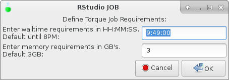
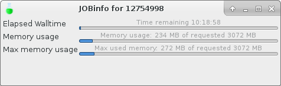

Using the supported software via utility scripts
************************************************

For mostly used applications in the cluster (e.g. Matlab, R), utility scripts are provided to integrate with job submission to the torque cluster.  Those scripts are built on top of the :doc:`software modules <software-modules>`.

Available software
==================

* :ref:`utility_script_matlab`
* :ref:`utility_script_rstudio`
* :ref:`utility_script_jupyter`

.. _utility_script_matlab:

Matlab
======

For running Matlab in the cluster, a set of wrapper scripts are available. They are part of the ``cluster`` module. With these wrapper scripts, one does not even need to load any corresponding modules in advance.

To start, for example, Matlab version 2014b, simply run the following command.

.. code-block:: bash

    % matlab2014b

The wrapper script uses internally the environment modules to configure the shell environment. It also decides the way of launching the Matlab program based on the function of the node on which the command is executed.  For instance, if the command is executed on an access node, an interactive torque job will be submitted to the cluster to start the Matlab program on one of the computer nodes.

.. _utility_script_rstudio:

RStudio
=======

Also for running a graphical version of RStudio to do your R analysis, another set of wrapper scripts will submit the job to the HPC cluster. In this case no prerequisitional steps have to be taken as the wrapper scripts will do so for you.

To start RStudio, just run the following command on the commandline of your terminal in your VNC session.

.. code-block:: bash

    % rstudio

The wrapper script starts a menu on which you can select your R/RStudio version combination. The latest versions are shown by default. Select your desired versions and click the OK button.

Next you will be asked for your job-requirements for walltime and memory to submit RStudio as a graphical job to the HPC cluster (just like starting you interactive graphical matlab session...). Define your requirements and hit the OK button.

The menu will close and will return you to your terminal. This shows the job is submitted and the jobID.

.. figure:: figures/rstudio_jobrunning.png
    :figwidth: 60%

You can check the status of your job with:

.. code-block:: bash

    % qstat [jobID]

The selected combination of R/RStudio starts, along with the graphical walltime/memory indicator...

.. figure:: figures/rstudio_running.png
    :figwidth: 60%

.. _utility_script_jupyter:

Jupyter Notebook
================

Jupyter notebook provides a web-based python environment for data analysis. To star it on the cluster, simply run the following command in the terminal within a VNC session.

.. code-block:: bash

    % jupyter-notebook

For the moment, only the Jupyter Notebook from Anaconda 3 is supported as it provides token-based protection on the notebook.

.. note::
    When using jupyter-notebook with the `conda environment <https://conda.io/docs/user-guide/tasks/manage-environments.html>`_.  One should also install jupyter package when creating the enviromnet so that your conda environment will be used within the notebook. For example,

    .. code-block:: bash
		    
	% conda create --name env jupyter
