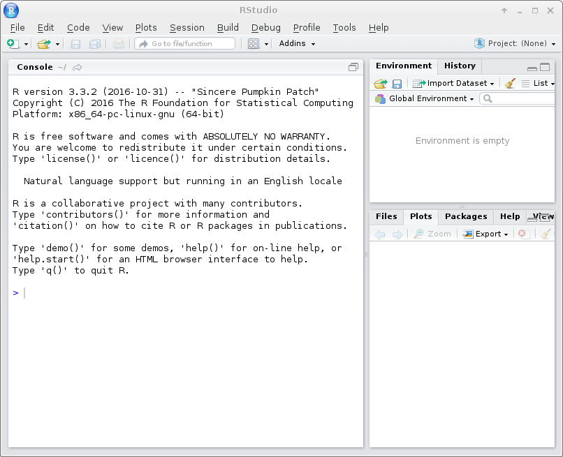

# Using the supported software in the cluster

Commonly used software are centrally managed and supported in the cluster. A list of the supported software can be found [here](http://intranet.donders.ru.nl/index.php?id=966). The repository where the software are organised and installed is mounted to the `/opt` directory on every cluster node.

In order to help users deal with the hassel of configuring shell environment for running the software, we use a tool called [_Environment Modules_](http://modules.sourceforge.net/) in the cluster.  Hereafter, we introduce few mostly used `module` commands for using the supported software in the cluster.

## Pre-configuration

You should have the `module` command available if you login to one of the mentat access node using a SSH client (e.g. putty). In the virtual terminal (i.e. GNOME Terminal or Konsole) of a VNC session, the `module` command may not be available immediately. If it happens to you, make sure the following lines are presented in the `~/.bashrc` file.

```bash
if [ -f /etc/bashrc ]; then
    source /etc/bashrc
fi
```

For example, run the following command in a terminal:

```bash
$ echo 'if [ -f /etc/bashrc ]; then source /etc/bashrc; fi' >> ~/.bashrc
```

Please note that you should close all existing terminals in the VNC session and start from a new terminal. In the new terminal, you should have the `module` command available.

## Showing available software

Firstly, one uses the `module` command to list the supported software in the cluster. This is done by the following command:

```bash
% module avail 
----------------------------- /opt/_modules -----------------------------------------------
32bit/brainvoyagerqx/1.10.4   cluster/1.0(default)          matlab/7.0.4                  mcr/R2011b
32bit/brainvoyagerqx/1.3.8    cuda/5.0                      matlab/7.1.0                  mcr/R2012a
32bit/brainvoyagerqx/1.8.6    cuda/5.5(default)             matlab/R2006a                 mcr/R2012b(default)
32bit/ctf/4.16                dcmtk/3.6.0(default)          matlab/R2006b                 mcr/R2013a
32bit/mricro/1.38_6           fsl/5.0.6                     matlab/R2014a                 python/2.6.5

## ... skip ...
```

As shown above, the software are represented as modules organised in name and version.  From the list, one selects a software (and version) by picking up a corresponding module. Assuming that we are going to run FSL version 5.0.6, the module to chose is named as `fsl/5.0.6`.

Tip: Software are installed in a directory with respect to the hierachy of the module names.  For instance, the FSL software corresponding to the module `fsl/5.0.6` is installed under the directory `/opt/fsl/5.0.6`.

## Loading software

After chosing a module, the next step is to `load` it to configure the shell environment accordingly for running the software. This is done via the `load` command. For example, to configure `fsl/5.0.6` one does 

```bash
% module load fsl/5.0.6
```

After that, one can check if a right version of the FSL executable is available.  For example,

```bash
% which fsl
/opt/fsl/5.0.6/bin/fsl
```

Tip: You can load more than one module at the same time.

## Unloading software

When a loaded software is no longer needed, one can easily rollback the shell environment configuration by unloading the specific module.  For instance,

```bash
% module unload fsl/5.0.6
```

As the configuration for running FSL version 5.0.6 is removed, the FSL executable becomes unavailable.  It makes sure that the environment is clean for running other software.

## Listing loaded software

In most of cases, you will load several software in one shell environment. To get an overview on the software loaded in the current shell, one can use the `list` option. For example,

```bash
% module list
Currently Loaded Modulefiles:
  1) fsl/5.0.6       2) R/3.1.2         3) cluster/1.0     4) matlab/R2012b
```

## Pre-loaded software

Right after logging into the cluster, you will find several pre-loaded software.  You can find them via `module list` command. Although you are free to unload them using the `module unload` command, you should always keep the module `cluster/1.0` loaded as it includes essential configurations for running computations in the cluster.

Tip: You should always keep the `cluster/1.0` module loaded.

## Running Matlab

For running Matlab in the cluster, a set of wrapper scripts are available. They are part of the `cluster` module. With these wrapper scripts, one does not even need to load any corresponding modules in advance. 

To start, for example, Matlab version 2014b, simply run the following command.

```bash
% matlab2014b
``` 

The wrapper script uses internally the environment modules to configure the shell environment. It also decides the way of launching the Matlab program based on the function of the node on which the command is executed.  For instance, if the command is executed on an access node, an interactive torque job will be submitted to the cluster to start the Matlab program on one of the computer nodes.

## Running RStudio

Also for running a graphical version of RStudio to do your R analysis, another set of wrapper scripts will submit the job to the HPC cluster. In this case no prerequisitional steps have to be taken as the wrapper scripts will do so for you.

To start RStudio, just run the following command on the commandline of your terminal in your VNC session.

```bash
% rstudio
``` 

The wrapper script starts a menu on which you can select your R/RStudio version combination. The latest versions are shown by default. Select your desired versions and click the OK button.


Next you will be asked for your job-requirements for walltime and memory to submit RStudio as a graphical job to the HPC cluster (just like starting you interactive graphical matlab session...). Define your requirements and hit the OK button.


The menu will close and will return you to your terminal. This shows the job is submitted and the jobID.


You can check the status of your job with:

```bash
% qstat [jobID]
``` 

The selected combination of R/RStudio starts, along with the graphical walltime/memory indicator...



