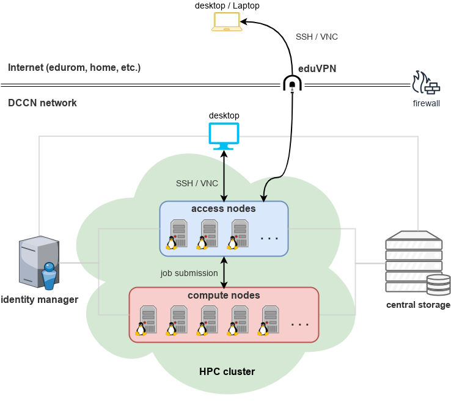

High Performance Computing for Neuroimaging Research
****************************************************

    Figure: the HPC environment at DCCN.

Computing Cluster
=================

The HPC cluster at DCCN consists of three groups of computer nodes, they are:

* **access nodes**: ``mentat001`` ~ ``mentat004`` as login nodes.
* **mentat compute nodes**: ``mentat203`` ~ ``mentat208`` used for long term (i.e. > 72 hours) computations.
* **Torque/Maui cluster**: a pool of powerful computers with more than 800 CPU cores, managed by the `Torque <http://www.adaptivecomputing.com/products/open-source/torque>`_ job manager and the `Moab <http://www.adaptivecomputing.com/products/open-source/maui/>`_ job scheduler.

Central Storage
===============

The central storage provides a shared file system amongst the Windows desktops within DCCN and the computers in the HPC cluster.

On the central storage, every user has a personal folder with a so-called office quota (20 gigabytes by default).  This personal folder is referred to as the ``M:\`` drive on the Windows desktops.

Storage spaces granted to research projects (following the `project proposal meeting(PPM) <http://intranet.donders.ru.nl/index.php?id=4502>`_) are also provided by the central storage.  The project folders are organised under the directory ``/project`` which is referred to as the ``P:\`` drive on the Windows desktops.

The central storage also hosts a set of commonly used software/tools for neuroimaging data processing and analysis.  This area in the storage is only accessible for computers in the HPC cluster as software/tools stored there require the Linux operating system.

Identity Manager
================

The identity manager maintains information for authenticating users accessing to the HPC cluster. It is also used to check users' identity when logging into the Windows desktops at DCCN. In fact, the user account received from `the DCCN check-in proceduer <https://intranet.donders.ru.nl/index.php?id=4465>`_ is managed secretely by this identity manager.

.. note::
    The user account concerned here (and throughout the entire wiki) is the one received via the DCCN check-in procedure.  It is, in most of cases, a combination of **the first three letters of your first name and the first three letters of your last name**.  It is **NOT** the account (i.e. U/Z/S-number) from the Radboud University.

Supported Software
==================

A list of supported software can be found `here <http://intranet.donders.ru.nl/index.php?id=torque_da_software>`_.
