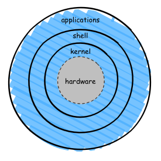

Very short introduction of Linux
********************************

`Linux <http://en.wikipedia.org/wiki/Linux>`_ is an operating system originally developed by `Linus Torvalds <http://en.wikipedia.org/wiki/Linus_Torvalds>`_ in 90's for cloning `the Unix operating system <http://en.wikipedia.org/wiki/Unix>`_ to personal computers (PCs). It is now one of the world-renowned software projects developed and managed by the open-source community.

With its open nature in software development, free in (re-)distribution, and many features inherited directly from Unix, the Linux system provides an ideal and affordable environment for software development and scientific computation. It is why Linux is widely used in most of scientific computing systems nowadays.

Architecture
============

The figure above illustrates a simplified view of the Linux architecture.  From inside out, the core of the system is called the **kernel**. It interacts with hardware devices, and provides upper layer components with low-level functions that hide complexity of, for example, arranging concurrent accesses to hardware. The **shell** is an interface to the kernel. It takes commands from user (or application) and executes kernel's functions accordingly. **Applications** are generally refer to system utilities providing advanced functionalities of the operating system, such as the tool ``cp`` for copying files.

File and process
================

Everything in Linux is either a **file** or a **process**.

A process in Linux refers to an executing program identified by an unique process identifier (PID). Processes are internally managed by the Linux kernel for the access to hardware resources (e.g. CPU, memory etc.).

In most of cases, a file in Linux is a collection of data. They are created by users using text editors, running compilers etc.  Hardware devices are also represented as files in the Linux.

Linux distributions
===================

Nowadays Linux is made available as a collection of selected software packages based around the Linux kernel. It is the so-called **Linux distribution**.  As of today, different Linux distributions are available on the market, each addresses the need of certain user community.

In the HPC cluster at DCCN, we use the `CentOS <http://www.centos.org/>`_ Linux distribution.  It is a well-maintained distribution developed closely with `RedHat <http://www.redhat.com/en>`_, a company providing commercial Linux distribution and support.  It is also widely used in many scientific computing systems in the world.
