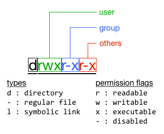

Understanding the Linux file system
***********************************

Data and software programs in the Linux system are stored in files organised in directories (i.e. folders). The file system is responsible for managing the files and directories.

In this wiki, you will learn about the tree structure of the file system and understand the syntax used to represent the file type and access permission. You will also learn the commands for creating, moving/copying, and deleting file and directories in the file system.

Present working directory
=========================

Right after you login to a Linux system, you are in certain working directory in the file system. It is the so-called **present working directory**. Knowing which working directory you are currently in can be done with the command ``pwd``.  For example,

.. code-block:: bash

    $ pwd
    /home/tg/honlee

The system responses to this command with a string representing the present working directory in a special notation. This string is referred to as the **path** to the present working directory. The string ``/home/tg/honlee`` from the above example is interpreted as follows:

In the Linux filesystem, directories and files are organised in a tree structure. The root of the tree is denoted by the ``/`` symbol as shown at the beginning of the string.  Following that is the first-level child directory called ``home``.  It is then separated from the second-level child ``tg`` by an additional ``/``` symbol. This notation convention repeats while moving down the child-directory levels, until the present working directory is reached. For instance, the present working directory in this example is the third-level child from the root, and it's called ``honlee``.  The hierarchy is also illustrated in the diagram below:

.. code-block:: bash

    /                   <-- the root directory
    |-- home            <-- first-level child
    |   |-- tg          <-- second-level child
    |   |   |-- honlee  <-- the present working directory

Changing the present working directory
======================================

With the file path notation, one changes the present working directory in the system using the ``cd`` command.  Continue with the above example, if we want to move to the ``tg`` directory, we do:

.. code-block:: bash

    $ cd /home/tg

Since the directory ``tg`` is one level up with respect to the present working directory, it can also be referred by the ``..``` symbol.  Therefore, an alternative to the previous command is:

.. code-block:: bash

    $ cd ..

The difference in between is that in the first command the directory ``tg`` is referred from the root directory using the so-called **absolute path**; while in the second it is referred relatively from the present working directory with the **relative path**.

Tip: the relative path to the present working directory is denoted by the symbol ``.``

The personal directory
======================

Every user has a personal directory in which the user has full access permission to manage data stored in it.  The absolute path of this directory is referred by an :ref:`environment variable <environment_variables>` called ``$HOME``.

Thus, one can always use the following command to change the present working directory to the personal directory.

.. code-block:: bash

    $ cd $HOME

.. Tip::
    One can also leave out ``$HOME`` in the above ``cd`` command to move to the personal directory.

Listing files in a directory
============================

For listing files and sub-directories in the present working directory, one use the ``ls`` command.  For example,

.. code-block:: bash

    $ ls

The option ``-l`` is frequently used to get more information about the files/directories.  For example,

.. code-block:: bash

    $ ls -l
    total 68
    drwxr-xr-x  2 honlee tg   4096 Aug 12 13:09 Desktop
    drwxr-xr-x  2 honlee tg   4096 Aug 21 16:15 matlab
    drwx------  5 honlee tg   4096 Mar  7 14:37 opt
    -rw-r--r--  1 honlee tg     84 Mar  5 10:47 startup.m
    -rwxr-xr-x  1 honlee tg    737 Aug 19 12:56 test.sh

File information are provided in columes.  They are summarised in the following table:

+--------+------------------+-----------------------------------------------+
| Column |  Example         | Information                                   |
+========+==================+===============================================+
| 1      | ``drwxr-xr-x``   | indicator for file type and access permission |
+--------+------------------+-----------------------------------------------+
| 2      | ``2``            | number of links to the file                   |
+--------+------------------+-----------------------------------------------+
| 3      | ``honlee``       | user ownership                                |
+--------+------------------+-----------------------------------------------+
| 4      | ``tg``           | group ownership                               |
+--------+------------------+-----------------------------------------------+
| 5      | ``4096``         | size of file in byte                          |
+--------+------------------+-----------------------------------------------+
| 6-8    | ``Aug 12 13:09`` | time of the last modification                 |
+--------+------------------+-----------------------------------------------+
| 9      | ``Desktop``      | name of the file                              |
+--------+------------------+-----------------------------------------------+

.. _linux_file_permission:

File type and permission
========================

The indicator for file type and access permission requires an interpretation, showing graphically in the picture below.



    The linux file permission.

The first character presents the type of the file.  In most of cases, you will see the character of ``d``, ``-``, or ``l`` corresponding to directory, regular or link file respectively.  The file-type character is followed by 9 additional characters organised in three sets, each consists of three characters representing the read (``r``), write (``w``) and execute (``x``) permissions of the file.  If certain permission is disabled, a ``-`` is shown instead.  The three sets, from left to right, indicate permissions for the user, the group (i.e. all users in the group), and others (i.e. all other users in the system). The user and group considered here are the user and group ownership (i.e. the third and fourth columns of the table above).

Changing file permission
========================

When you are the owner of a file (or you have the write permission of it), you can change the file permission.  To change the permission, we use the ``chmod`` command.

For example, to make a file call ``test`` readable for all users in the system, one does

.. code-block:: bash

    $ chmod o+r test

The syntax ``o+r`` stands for **add read permission for others**.  By replacing the character ``o`` with ``u`` or ``g``, one adds read permission for **user** or **group**.  Replacing ``r`` with ``w`` or ``x`` will set **write** or **execute** permission instead of read. Using ``-`` instead of ``+`` **removes** permissions accordingly.

Copying and (re-)moving files
=============================

For copying a file, one uses the ``cp`` command.  Assuming there is a file at path ``/home/tg/test``, to make a copy of it and place the copy at path ``/home/tg/test.copy``, one does

.. code-block:: bash

    $ cp /home/tg/test /home/tg/test.copy


It requires the ``-R`` option to copy a directory.  For example, to copy a directory at path ``/home/tg/test_dir`` to ``/home/tg/test_dir.copy``, one does

.. code-block:: bash

    $ cp -R /home/tg/test_dir /home/tg/test_dir.copy

For moving a file/directory from one path to another, one uses the ``mv`` command:

.. code-block:: bash

    $ mv /home/tg/test /home/tg/test.move
    $ mv /home/tg/test_dir /home/tg/test_dir.move

To delete (remove) a file from the file system, one uses the ``rm`` command:

.. code-block:: bash

    $ rm /home/tg/test

When deleting a directory from the file system, the directory should be emptied first, i.e. not contains any files or sub-directories in it. The ``-r`` option simplify the deletion of a directory by removing files and sub-directories iteratively.

Creating new directory
======================

Creating a directory is done by using the ``mkdir`` command.  The following command create a new directory at path ``/home/tg/new_dir``.

.. code-block:: bash

    $ mkdir /home/tg/new_dir

The system assumes that the parent paths (``/home`` and ``/home/tg``) exist a prior the creation of ``/home/tg/new_dir``.  The option ``-p`` is used to create necessary parent directories.

Using wildcards
===============

Wildcards are special syntax in specifying a group of files with some part of their names in common.  Linux commands can use wildcards to perform actions on more than one files at a time. The mostly used wildcard syntax is the asterisk ``*`` representing any number of characters.

In the example below, the wildcard is used to remove files with prefix ``subject_`` and suffix ``.out`` in the present workding directory

.. code-block:: bash

    $ ls
    subject_1.dat  subject_2.dat  subject_3.dat  subject_4.dat  subject_5.dat
    subject_1.out  subject_2.out  subject_3.out  subject_4.out  subject_5.out

    $ rm subject_*.out

    $ ls
    subject_1.dat  subject_2.dat  subject_3.dat  subject_4.dat  subject_5.dat

.. Tip::
    More wildcard syntax can be found `here <http://tldp.org/LDP/GNU-Linux-Tools-Summary/html/x11655.htm>`_.
